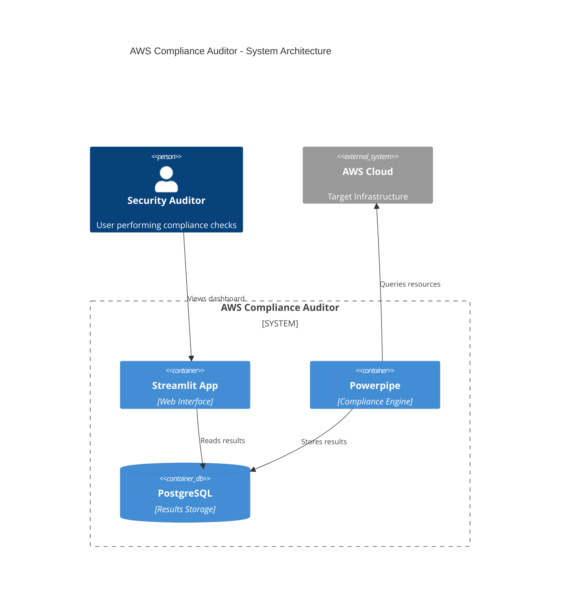
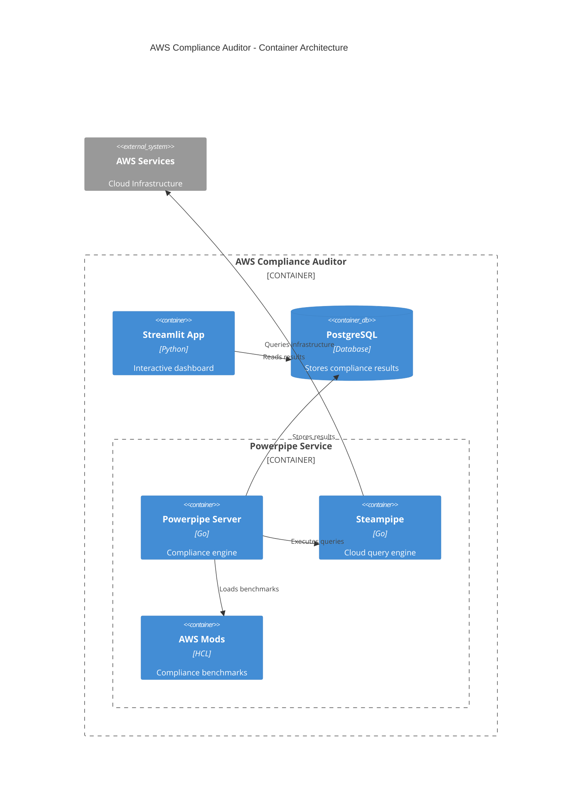

# AWS Compliance Auditor

A Streamlit-based dashboard for crosswalking compliance documentation and dynamic auditing of AWS infrastructure against security controls using [Steampipe/Powerpipe - as query engine](https://powerpipe.io/docs/run).

## ⚠️ Security Notice

This tool requires AWS credentials to perform compliance auditing. For security best practices:

1. Create [AWS Security Audit User in AWS Console](https://docs.aws.amazon.com/IAM/latest/UserGuide/access_policies_job-functions.html#jf_security-auditor) 
1. With an attached IAM [SecurityAudit](https://docs.aws.amazon.com/aws-managed-policy/latest/reference/SecurityAudit.html) Role
1. With an attached `Supplemental Policy` for additional services:

```json
{
    "Version": "2012-10-17",
    "Statement": [
        {
            "Effect": "Allow",
            "Action": [
                "securityhub:*",
                "config:*",
                "cloudtrail:*",
                "identitystore:*",
                "ds:*"
            ],
            "Resource": "*"
        }
    ]
}
```

## Features
- AWS SSO Management Interface
- Security Controls Compliance Checking
- Interactive Data Visualization
- Automated Compliance Reports

## Architecture

### System Context (C4)


### Container View


## Implementation Details

### 1. Service Components

#### Streamlit App (Port 8501)
- Web interface for compliance dashboard
- Reads results from PostgreSQL
- Manages AWS authentication
- Displays compliance reports

#### Powerpipe Service (Port 9033)
- Runs compliance checks using Steampipe
- AWS compliance benchmarks pre-installed
- Executes as non-root user
- Auto-updates available

#### PostgreSQL Database
- Stores compliance results
- Shared credentials via environment
- Automatic password generation
- Health checking enabled

### 2. Data Flow
1. Powerpipe executes compliance checks
2. Results stored in PostgreSQL
3. Streamlit reads from database
4. Real-time updates via polling

### 3. Security Features
- Non-root container execution
- Automated password generation
- Read-only secrets mounting
- Database credential sharing
- AWS authentication handling

## Setup

### Local Development
```bash
# Create secrets file
cp .streamlit/secrets.toml.example .streamlit/secrets.toml

# Configure environment
cp .env.example .env
```

### Docker Deployment
```bash
# Build and start services
docker-compose up -d

# View logs
docker-compose logs -f

# Check service status
docker-compose ps
```

### Local (Conda Environment)
1. Set up Python environment:
```bash
conda env create -f environment.yml
conda activate app

# If you need to rebuild/remove the environment:
conda deactivate
conda env remove -n app
```

2. Configure Steampipe:
```bash
mkdir -p ~/.steampipe/config
cp steampipe/aws.spc ~/.steampipe/config/
```

3. Configure AWS credentials:
```bash
cp .streamlit/secrets.toml.example .streamlit/secrets.toml
# Edit secrets.toml with your AWS credentials
```

5. Start the application:
```bash
streamlit run app.py
```

### Docker
```
.
├── app.py              # Main Streamlit application
├── Dockerfile          # Docker configuration
├── docker-compose.yml  # Docker services configuration
├── environment.yml     # Conda environment specification
└── steampipe/         # Steampipe configurations
    └── aws.spc        # AWS plugin configuration
```

### Zscaler Configuration

If you're running this application in an environment using Zscaler for SSL/TLS inspection:

1. Obtain Zscaler Root Certificate:
   - Download from your organization's Zscaler portal
   - Or extract from your browser's trusted certificates

2. Configure environment:
   ```bash
   # Copy and edit .env file
   cp .env.example .env
   
   # Set Zscaler configuration
   ZSCALER_CERT=/path/to/ZscalerRootCertificate.crt
   HTTP_PROXY=http://your-zscaler-proxy:80
   HTTPS_PROXY=http://your-zscaler-proxy:80
   NO_PROXY=localhost,127.0.0.1
   ```

3. Build with Zscaler support:
   ```bash
   docker-compose build --no-cache
   ```

Note: If not using Zscaler, leave ZSCALER_CERT commented out in .env file.

## Troubleshooting

### Common Issues
1. Steampipe connection errors:
   - Verify AWS credentials

2. Database connection issues:
   - For Docker: `docker-compose logs db`
   - For local: Check PostgreSQL service status

## Contributing

1. Fork the repository
2. Create a feature branch
3. Submit a pull request


